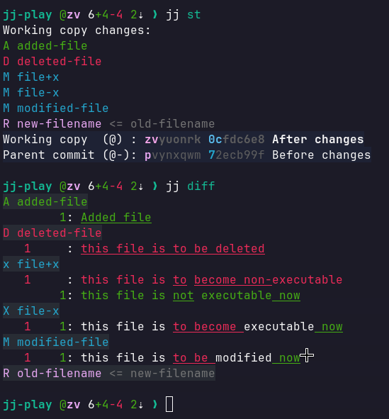

## What it does

Takes jj output and applies some formatting to it before it goes to the pager.

Features:
- Use status prefixes (A, M, D, R) also in diff
- Use x (-x) and X (+x) in diff for executable change
- highlight change ID lines with grey backgrund to line end
- highlight file lines of diff with grey backgrund to line end
- replace \ by / in filenames on Windows



## Install

Add it as pager to jj config by:

```toml
[ui]
pager = "jj-format less -FrfX"
```
